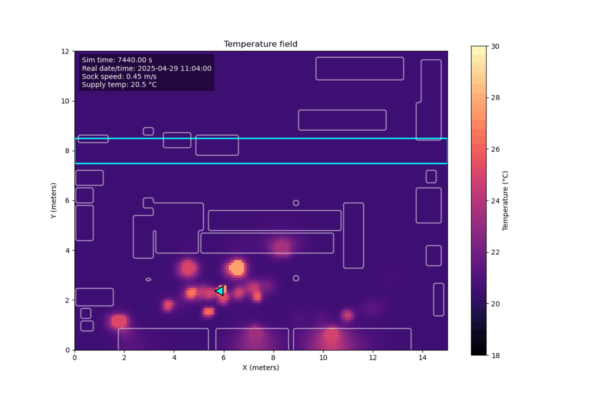

# Cleanroom CFD Demo

A simplified 2D CFD-style model of cleanroom airflow and heat transfer, designed for testing, visualization, and validation workflows.

## Features

- SVG-based room geometry parsing
- Cartesian grid and obstacle-mask generation
- Pressure-projection airflow update
- Temperature advection and diffusion
- Air-sock tracer visualization
- Notebook-based demo for experimentation and presentation

## Installation

The project can be installed with Conda using the provided environment file.

Create the environment with:

```bash
conda env create -f environment.yml
```
Activate it with 

```bash
conda activate cleanroom-cfd
```
## Run
Install requirements, then open `notebooks/demo.ipynb`.

## Temperature Field Simulation


The result of the simulation is a temperature field of the entire clean room
